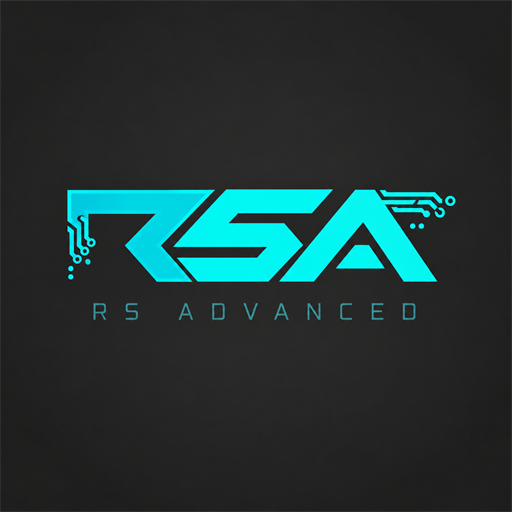

  

# RS Advanced

An addon for **Refined Storage 2** that expands storage and automation. Includes infinite cobblestone and water cells; datapacks can add more item and fluid sources.

## Features

- **Infinite Cobblestone Cell** — an endless source of cobblestone.
- **Infinite Water Cell** — an endless source of water.

Each cell shows a small resource icon in its lower-right corner in inventories. Infinite cells appear in the Refined Storage creative tab. Hold Shift over a cell to view its help tooltip.

Craft an Infinite Storage Part from a 64K Storage Part and a Nether Star. Combine it with a Storage Housing and the cell's resource (a bucket for fluids) to craft a cell.

Install a cell in a standard **Disk Drive** connected to a powered RS network. Access its resource through the Grid or automation devices.

Cells need no initial filling and never run out. They also absorb returned resources of their own type without accumulating them. Infinite sources are marked with **∞**; ordinary disks keep their normal storage behavior and priorities.

## Custom cells

Add item or fluid definitions and ordinary crafting recipes through a datapack — no Java changes,
compilation or datagen needed. Names use the resource’s client translation automatically.
See the [lava datapack example](docs/examples/lava-datapack) and [setup instructions](docs/DEVELOPMENT.md).
Reopen the world or restart the server after changing cell definitions.

## Installation

For **Minecraft 1.21.1** with **NeoForge 21.1.256+** or **Fabric Loader 0.17.2+**. Requires Java 21.

Install RS Advanced on both the client and server, together with:

- **Refined Storage 2.0.9** and its required dependencies.
- **Architectury API 13.0.11+**.
- **Fabric API** for the Fabric version.

Use the release JAR matching your loader. Forge is not supported.

## Build

With JDK 21 installed, run `gradlew.bat build` on Windows or `bash gradlew build` on Linux/macOS. Release JARs are in `fabric/build/libs` and `neoforge/build/libs`; use the files without `dev` or `sources` in their names.

See [development notes](docs/DEVELOPMENT.md) and [validation results](VALIDATION.md) for architecture, tests, and known limitations.

Licensed under the [MIT License](LICENSE).
